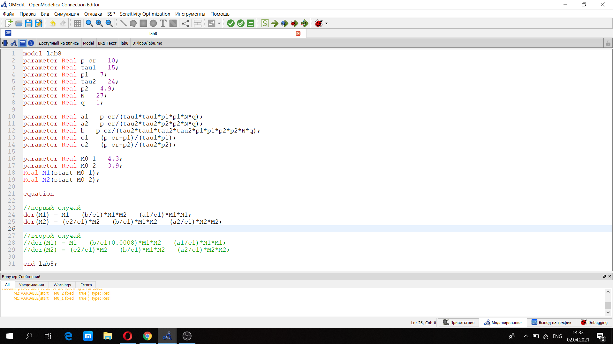
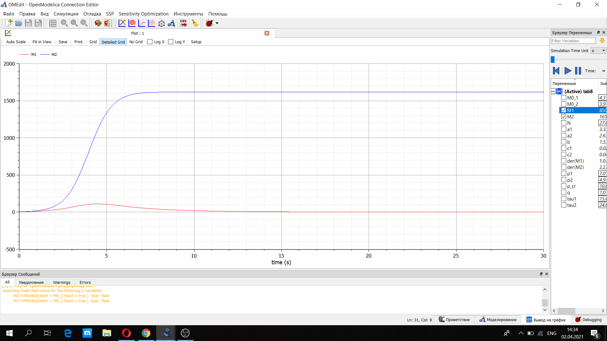

---
# Front matter
lang: ru-RU
title: "Лабораторная работа №8"
author: "Селезнев Василий Александрович"

# Formatting
toc-title: "Содержание"
toc: true # Table of contents
toc_depth: 2
lof: true # List of figures
lot: true # List of tables
fontsize: 12pt
linestretch: 1.5
papersize: a4paper
documentclass: scrreprt
polyglossia-lang: russian
polyglossia-otherlangs: english
mainfont: PT Serif
romanfont: PT Serif
sansfont: PT Sans
monofont: PT Mono
mainfontoptions: Ligatures=TeX
romanfontoptions: Ligatures=TeX
sansfontoptions: Ligatures=TeX,Scale=MatchLowercase
monofontoptions: Scale=MatchLowercase
indent: true
pdf-engine: lualatex
header-includes:
  - \linepenalty=10 # the penalty added to the badness of each line within a paragraph (no associated penalty node) Increasing the value makes tex try to have fewer lines in the paragraph.
  - \interlinepenalty=0 # value of the penalty (node) added after each line of a paragraph.
  - \hyphenpenalty=50 # the penalty for line breaking at an automatically inserted hyphen
  - \exhyphenpenalty=50 # the penalty for line breaking at an explicit hyphen
  - \binoppenalty=700 # the penalty for breaking a line at a binary operator
  - \relpenalty=500 # the penalty for breaking a line at a relation
  - \clubpenalty=150 # extra penalty for breaking after first line of a paragraph
  - \widowpenalty=150 # extra penalty for breaking before last line of a paragraph
  - \displaywidowpenalty=50 # extra penalty for breaking before last line before a display math
  - \brokenpenalty=100 # extra penalty for page breaking after a hyphenated line
  - \predisplaypenalty=10000 # penalty for breaking before a display
  - \postdisplaypenalty=0 # penalty for breaking after a display
  - \floatingpenalty = 20000 # penalty for splitting an insertion (can only be split footnote in standard LaTeX)
  - \raggedbottom # or \flushbottom
  - \usepackage{float} # keep figures where there are in the text
  - \floatplacement{figure}{H} # keep figures where there are in the text
---

# Цель работы

Познакомиться с моделью конкуренции двух фирм для двух случаев(без учета и с учетом социально-психологического фактора) и построить их, используя язык программирования Modelica.

# Задание

1. Построить графики изменения оборотных средств фирмы 1 и фирмы 2 без учета постоянных издержек и с веденной нормировкой для случая 1 (без учета социально-психологического фактора).
2. Построить графики изменения оборотных средств фирмы 1 и фирмы 2 без учета постоянных издержек и с веденной нормировкой для случая 2 (с учетом социально-психологического фактора).

# Выполнение лабораторной работы

Система уравнений для первого случая (без учета социально-психологического фактора):

$$ \frac{dM_1}{d\theta} = M_1 - \frac{b}{c_1} M_1 M_2 - \frac{a_1}{c_1} M_1^2 $$

$$ \frac{dM_2}{d\theta} = \frac{c_2}{c_1} M_2 - \frac{b}{c_1} M_1 M_2-\frac{a_2}{c_1} M_2^2 $$

где $$ a_1 = \frac{p_{cr}}{{\tau}_1^2 p_1^2 N q }, a_2 = \frac{p_{cr}}{{\tau}_2^2 p_2^2 N q}, b = \frac{p_{cr}}{{\tau}_1^2 p_1^2 {\tau}_2^2 p_2^2 N q } $$
$$ c_1 = \frac{p_{cr} - p_1}{{\tau}_1 p_1}, c_2 = \frac{p_{cr} - p_2}{{\tau}_2 p_2}$$  

Также введена нормировка $t = c_1 \theta$.  
Система уравнений для второго случая (с учетом социально-психологического фактора) принимает следующий вид:

$$ \frac{dM_1}{d\theta} = M_1 - (\frac{b}{c_1} + 0.0008)M_1 M_2-\frac{a_1}{c_1} M_1^2 $$

$$ \frac{dM_2}{d\theta} = \frac{c_2}{c_1} M_2 - \frac{b}{c_1}M_1 M_2-\frac{a_2}{c_1} M_2^2 $$

Начальные условия для обеих задач принимают следующий вид:  
$$ M_0^1 = 4.3, M_0^2 = 3.9, p_cr = 10, N = 27, q = 1, \tau_1 = 15, \tau_2 = 24, p_1 = 7, p_2 = 4.9$$  
Обозначения:  
N - число потребителей производимого продукта  
$\tau$ - длительность производственного цикла  
p~cr~ - критическая стоимость продукта  
p - себестоимость продукта  
q - максимальная потребность одного человека в продукте в единицу времени  
$\theta=\frac{t}{c_1}$ - безразмерное время.

Ниже представлен скриншот кода программы, написанный на языке программирования Modelica. (рис 1. -@fig:001)  

{ #fig:001 width=70% }  

Построим графики изменения оборотных средств фирмы 1 и фирмы 2 для случая 1 (без учета социально-психологического фактора). (рис -@fig:001)  

{ #fig:001 width=70% }  

Также построим графики изменения оборотных средств фирмы 1 и фирмы 2 для случая 2 (с учетом социально-психологического фактора). (рис 3. -@fig:001)  

{ #fig:001 width=70% }    

# Выводы

Я ознакомился с моделью конкуренции двух фирм для двух случаев (без учета и с учетом социально-психологического фактора). Построил для них графики, используя язык программирования Modelica.
